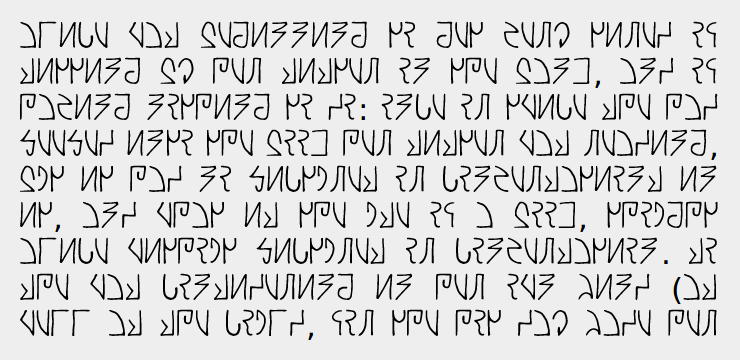

# This repository has been moved to [gitlab.com/paul-nechifor/sidrem](http://gitlab.com/paul-nechifor/sidrem).

Old readme:

# Sidrem

This is a Python script which turns my [constructed script][conscript] from SVG
shapes to an SVG font. [Try it][tryit] on my web site.

## Usage

Start the server and watch for changes:

    npm start

## License

ISC

[conscript]: http://en.wikipedia.org/wiki/Constructed_script
[tryit]: http://nechifor.net/sidrem
